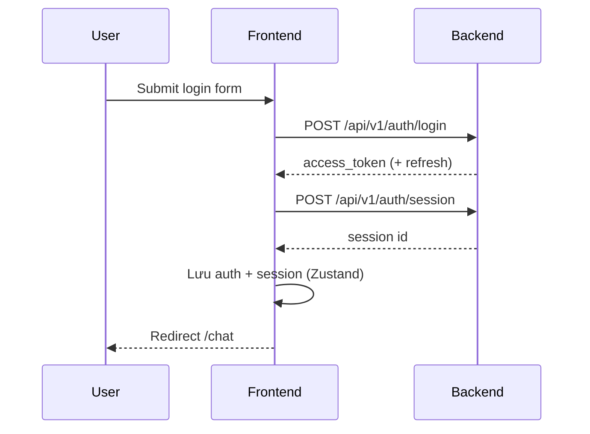

# Thiết kế kiến trúc Frontend — UGC Agent

- **Dự án:** UGC Agent
- **Version:** v0.1
- **Cập nhật:** 2026-07-02
- **Phạm vi:** Web SPA — auth, session, chat (UGC APIs sắp triển khai)
- **Người phụ trách:** Tech Lead FE

> Ví dụ điền mẫu — tham chiếu [system-overview](../system-overview/system-overview.md). Chuẩn lỗi API: [api-error-handling.example.md](../api-error-handling/api-error-handling.example.md).

---

## 1. Công nghệ & Thư viện cốt lõi (Tech Stack)

| Hạng mục | Công nghệ | Phiên bản | Ghi chú |
|----------|-----------|-----------|---------|
| **Framework** | React | 19.x | SPA |
| **Ngôn ngữ** | TypeScript | 5.x | `strict: true` |
| **Build tool** | Vite | 6.x | Dev server + production build |
| **UI** | Material UI (MUI) | 6.x | Component chính; không dùng thẻ HTML thuần |
| **Styling** | SCSS + MUI `sx` | — | SCSS ưu tiên; đồng bộ token từ theme MUI |
| **Routing** | React Router | 7.x | Data router, lazy route |
| **Server state** | TanStack Query | 5.x | Cache API, retry, staleTime |
| **Client state** | Zustand | 5.x | Auth session, UI shell (sidebar, theme) |
| **Form** | react-hook-form | 7.x | Kết hợp MUI `Controller` |
| **HTTP** | Axios | 1.x | Instance chung + interceptors |
| **i18n** | react-i18next | — | `en` / `vi`; gửi `Accept-Language` theo [api-error-handling](../api-error-handling/api-error-handling.example.md) |

**Design Token:** map trong `src/theme/` — màu viết hoa (`#CCCCCC`), line-height unitless, không `!important`.

---

## 2. Cấu trúc thư mục dự án (Project Directory Structure)

```
frontend/
├── public/
├── src/
│   ├── app/                    # Bootstrap, providers, router root
│   ├── pages/                  # Route-level views (Login, Chat, Sessions…)
│   ├── components/             # UI tái sử dụng (theo feature hoặc shared)
│   ├── features/               # auth/, chat/, session/ — logic + UI theo domain
│   ├── hooks/                  # useAuth, useChatStream, …
│   ├── services/               # apiClient, authService, chatService
│   ├── store/                  # Zustand slices
│   ├── theme/                  # MUI theme, palette, typography
│   ├── types/                  # API types, domain types
│   ├── constants/              # routes, query keys
│   ├── utils/                  # format, error mapper
│   ├── assets/
│   └── styles/                 # Global SCSS
├── vite.config.ts
└── package.json
```

| Thư mục | Trách nhiệm | Quy tắc |
|---------|-------------|---------|
| `pages/` | View gắn route | Một page = một route chính; lazy import |
| `features/` | Domain module | `features/auth/components/LoginForm/` |
| `components/` | Shared UI | PascalCase; className ngoài cùng = tên file |
| `services/` | Gọi API | Không import React; trả typed promise |
| `store/` | Global client state | Không chứa server cache (để Query) |

---

## 3. Luồng xử lý chung (Common Flows & Core Mechanisms)

### 3.1 Authentication Flow

| Bước | Mô tả |
|------|--------|
| Đăng nhập | `POST /api/v1/auth/login` — OAuth2 password grant |
| Lưu token | Access token trong memory (Zustand); refresh trong HttpOnly cookie (khi BE hỗ trợ) |
| Phiên làm việc | `POST /api/v1/auth/session` sau login — tạo session chat |
| Refresh | Interceptor 401 → `POST /api/v1/auth/refresh` (planned) |
| Đăng xuất | Xóa store + gọi revoke nếu có → redirect `/login` |



### 3.2 Routing & Permission

| Loại route | Path | Guard |
|------------|------|-------|
| Public | `/login`, `/register` | Đã login → redirect `/chat` |
| Protected | `/chat`, `/sessions`, `/settings` | Chưa login → `/login` |
| Role-based | `/admin/*` | Role `admin` — tham chiếu [matrix-design](../matrix-design/matrix-design.md) |

- Guard: `ProtectedRoute` đọc `useAuthStore`; không render children khi chưa authenticated.
- Menu ẩn theo role — không thay thế kiểm tra quyền phía BE.

### 3.3 Error & Exception Handling

| Tình huống | Cách xử lý |
|------------|------------|
| API 4xx/5xx | Map theo `error.code` — [api-error-handling](../api-error-handling/api-error-handling.example.md) §9 |
| `validation_error` | `details[]` → field errors trên form (react-hook-form `setError`) |
| `invalid_token` | Clear auth → redirect login |
| `rate_limited` | Toast + đọc `Retry-After` header |
| Network offline | Banner + nút retry (Query `refetch`) |
| Uncaught render | `ErrorBoundary` + fallback page |

**Không** match lỗi bằng full `message` text — chỉ dùng `error.code`.

### 3.4 Loading & Skeleton

| Pattern | Dùng khi |
|---------|----------|
| `CircularProgress` full-page | Bootstrap app / verify session lần đầu |
| MUI `Skeleton` | Danh sách session, lịch sử chat |
| `LoadingButton` (MUI) | Submit login / register |
| `React.lazy` + `Suspense` | Code-split từng route |

### 3.5 Data fetching convention

| Quy ước | Chi tiết |
|---------|----------|
| Query key | `['sessions']`, `['session', id]`, `['chat', sessionId]` |
| Mutation | Invalidate query liên quan sau success |
| Optimistic UI | Chỉ chat gửi tin — rollback khi API fail |
| Polling / SSE | Chat stream: SSE hoặc WebSocket (chốt ở DD chat) |

---

## 4. Tiêu chuẩn viết Code & Hiệu năng (Coding Standards & Performance)

### 4.1 Coding Convention

| Mục | Quy ước |
|-----|---------|
| Component | MUI `Box` thay `div`; mỗi file có className ngoài cùng = tên component |
| TypeScript | Không `any`; type API trong `types/api/` |
| ESLint | Flat config; chạy trên CI |
| SCSS | Module SCSS cạnh component khi cần; không `&` ghép tên lớp |
| Comment | Tiếng Anh; giải thích *why* |
| Label | `<label>` chỉ trong form field MUI |

### 4.2 Performance Optimization

| Kỹ thuật | Áp dụng |
|----------|---------|
| Route lazy load | `pages/Chat`, `pages/Sessions` |
| Query `staleTime` | Session list 30s; chat messages theo DD |
| `React.memo` | Chỉ khi đo được re-render (list item) |
| Ảnh / media UGC | Lazy load; kích thước responsive |
| Bundle analyze | `vite build --mode analyze` hàng release |

---

## 5. Tích hợp API & Hợp đồng client

| Mục | Quy ước |
|-----|---------|
| Base URL | `import.meta.env.VITE_API_BASE_URL` |
| Auth header | `Authorization: Bearer {access_token}` |
| Locale | Header `Accept-Language: vi` \| `en` |
| Error envelope | `error.code`, `error.details[]`, `error.request_id` |
| Log support | Hiển thị `request_id` trong toast lỗi 5xx (dev/staging) |

Chi tiết mã lỗi: [api-error-handling.example.md](../api-error-handling/api-error-handling.example.md).

---

## 6. Trạng thái triển khai (Implementation Status)

| Hạng mục | Trạng thái | Ghi chú |
|----------|------------|---------|
| Auth pages (login/register) | Partial | Login xong; register chờ BE |
| Session list | Planned | API có; UI chưa |
| Chat UI | Planned | Scope v0.2 |
| Axios interceptor + error map | Partial | 401 handled; full code map pending |
| i18n message từ API | Pending | Chờ BE locale đầy đủ |
| Refresh token flow | Pending | Cookie HttpOnly chưa chốt |

---

## 7. Đường dẫn code hiện tại (Implementation Paths)

| Khu vực | Path (khi có code) |
|---------|-------------------|
| App bootstrap | `frontend/src/app/` |
| Router | `frontend/src/app/router.tsx` |
| API client | `frontend/src/services/apiClient.ts` |
| Auth feature | `frontend/src/features/auth/` |
| Theme | `frontend/src/theme/` |
| Env | `frontend/.env.example` |

---

## Tài liệu liên quan

| Loại | Đường dẫn |
|------|-----------|
| System Overview | [system-overview.md](../system-overview/system-overview.md) |
| Architecture BE | [backend-architecture.md](../architecture-be/backend-architecture.md) |
| API error handling | [api-error-handling.example.md](../api-error-handling/api-error-handling.example.md) |
| Matrix design | [matrix-design.md](../matrix-design/matrix-design.md) |
| NFR | [03_non-functional-requirements](../../../03_non-functional-requirements/catalog.md) |

## Phê duyệt

| | |
|---|---|
| **Người review** | |
| **Ngày** | |
| **Trạng thái** | draft |
