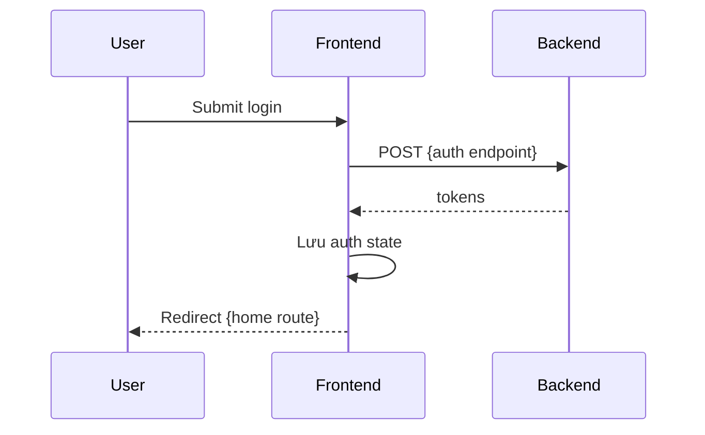

# Thiết kế kiến trúc Frontend — {Tên dự án}

- **Dự án:** {Tên dự án}
- **Version:** v{X.Y}
- **Cập nhật:** YYYY-MM-DD
- **Phạm vi:** {Web SPA / Admin / Mobile web — module chính}
- **Người phụ trách:** {Tech Lead FE}

> Copy thành `frontend-architecture.md` (cùng thư mục, bỏ prefix `_`). Tham chiếu [system-overview](../system-overview/system-overview.md). Ví dụ điền mẫu: [_frontend-architecture.example.md](./_frontend-architecture.example.md).

---

## 1. Công nghệ & Thư viện cốt lõi (Tech Stack)

| Hạng mục | Công nghệ | Phiên bản | Ghi chú |
|----------|-----------|-----------|---------|
| **Framework** | {React / Vue / Next.js / …} | | |
| **Ngôn ngữ** | {TypeScript / …} | | |
| **Build tool** | {Vite / Webpack / …} | | |
| **UI** | {MUI / Ant Design / …} | | Component chính |
| **Styling** | {SCSS / Tailwind / MUI sx / …} | | Design token / theme |
| **Routing** | {React Router / Next App Router / …} | | |
| **Server state** | {TanStack Query / SWR / …} | | Cache API |
| **Client state** | {Zustand / Redux Toolkit / Context / …} | | Auth, UI shell |
| **Form** | {react-hook-form / Formik / …} | | |
| **HTTP** | {Axios / fetch wrapper / …} | | Instance + interceptors |
| **i18n** | {react-i18next / …} | | Locale + `Accept-Language` |

**Design Token:** {Vị trí file theme / token — bổ sung khi chốt UI kit}

---

## 2. Cấu trúc thư mục dự án (Project Directory Structure)

```
frontend/
├── public/
├── src/
│   ├── app/                    # Bootstrap, providers, router root
│   ├── pages/                  # Route-level views
│   ├── components/             # UI tái sử dụng (shared)
│   ├── features/               # {domain}/ — logic + UI theo module
│   ├── hooks/                  # Custom hooks
│   ├── services/               # apiClient, *Service
│   ├── store/                  # Global client state
│   ├── theme/                  # Theme / design token
│   ├── types/                  # API & domain types
│   ├── constants/              # routes, query keys
│   ├── utils/                  # helpers, error mapper
│   ├── assets/
│   └── styles/                 # Global SCSS/CSS
└── …
```

| Thư mục | Trách nhiệm | Quy tắc |
|---------|-------------|---------|
| `pages/` | View gắn route | Một page = một route chính; lazy khi cần |
| `features/` | Module theo domain | `{feature}/components/`, `{feature}/hooks/` |
| `components/` | Shared UI | PascalCase file; quy ước đặt tên component |
| `services/` | Gọi API | Không import UI framework |
| `store/` | Client state | Không trùng server cache (để Query/SWR) |

---

## 3. Luồng xử lý chung (Common Flows & Core Mechanisms)

### 3.1 Authentication Flow

| Bước | Mô tả |
|------|--------|
| Đăng nhập | {Endpoint, payload} |
| Lưu token | {Memory / localStorage / HttpOnly cookie} |
| Phiên / context | {Session, tenant, … nếu có} |
| Refresh | {Cơ chế khi access token hết hạn} |
| Đăng xuất | {Revoke, clear store, redirect} |



### 3.2 Routing & Permission

| Loại route | Path | Guard |
|------------|------|-------|
| Public | {/login, …} | {Đã login → redirect} |
| Protected | {/dashboard, …} | {Chưa login → /login} |
| Role-based | {/admin/*, …} | {Role — tham chiếu matrix-design} |

- Guard component / middleware: {mô tả ngắn}
- Ẩn menu theo role — không thay kiểm tra quyền BE.

### 3.3 Error & Exception Handling

| Tình huống | Cách xử lý |
|------------|------------|
| API 4xx/5xx | Map theo `error.code` — [api-error-handling.md](../api-error-handling/api-error-handling.md) |
| `validation_error` | `details[]` → lỗi field trên form |
| `invalid_token` / 401 | Clear auth → login |
| `rate_limited` | Toast + `Retry-After` |
| Network offline | Banner + retry |
| Uncaught render | Error boundary + fallback page |

**Không** match lỗi bằng full `message` — chỉ dùng `error.code`.

### 3.4 Loading & Skeleton

| Pattern | Dùng khi |
|---------|----------|
| Full-page loader | Bootstrap / verify session lần đầu |
| Skeleton | List, card đang tải |
| Button loading | Submit form |
| Lazy + Suspense | Code-split route |

### 3.5 Data fetching convention

| Quy ước | Chi tiết |
|---------|----------|
| Query key | {Ví dụ: `['resource', id]`} |
| Mutation | Invalidate query sau success |
| Optimistic UI | {Khi nào dùng / không dùng} |
| Realtime | {Polling / SSE / WebSocket — nếu có} |

---

## 4. Tiêu chuẩn viết Code & Hiệu năng (Coding Standards & Performance)

### 4.1 Coding Convention

| Mục | Quy ước |
|-----|---------|
| Component / UI kit | {MUI Box thay div, …} |
| TypeScript | Không `any`; types API tách file |
| Lint / format | {ESLint, Prettier — link config} |
| Styling | {SCSS module, theme, …} |
| Comment | Tiếng Anh; giải thích *why* |
| Khác | {Label form, className, …} |

### 4.2 Performance Optimization

| Kỹ thuật | Áp dụng |
|----------|---------|
| Route lazy load | {Routes cần split} |
| API cache | {staleTime, cache policy} |
| Memoization | {Khi nào dùng useMemo/memo} |
| Media / assets | {Lazy load, format} |
| Bundle analyze | {Tool / tần suất} |

---

## 5. Tích hợp API & Hợp đồng client

| Mục | Quy ước |
|-----|---------|
| Base URL | {env var} |
| Auth header | {Bearer / cookie / …} |
| Locale | Header `Accept-Language` |
| Error envelope | `error.code`, `error.details[]`, `error.request_id` |
| Log support | Hiển thị `request_id` khi cần debug |

Chi tiết mã lỗi: [api-error-handling.md](../api-error-handling/api-error-handling.md).

---

## 6. Trạng thái triển khai (Implementation Status)

| Hạng mục | Trạng thái | Ghi chú |
|----------|------------|---------|
| {Module / page} | Done / Partial / Planned / Pending | |
| {Interceptor / error map} | | |
| {i18n} | | |

---

## 7. Đường dẫn code (Implementation Paths)

| Khu vực | Path |
|---------|------|
| App bootstrap | `{frontend/src/app/}` |
| Router | `{path}` |
| API client | `{path}` |
| Theme | `{path}` |
| Env example | `{frontend/.env.example}` |

---

## Tài liệu liên quan

| Loại | Đường dẫn |
|------|-----------|
| System Overview | [system-overview.md](../system-overview/system-overview.md) |
| Architecture BE | [backend-architecture.md](../architecture-be/backend-architecture.md) |
| API error handling | [api-error-handling.md](../api-error-handling/api-error-handling.md) |
| Matrix design | [matrix-design.md](../matrix-design/matrix-design.md) |
| NFR | [03_non-functional-requirements](../../../03_non-functional-requirements/catalog.md) |

## Phê duyệt

| | |
|---|---|
| **Người review** | |
| **Ngày** | |
| **Trạng thái** | draft / approved |
