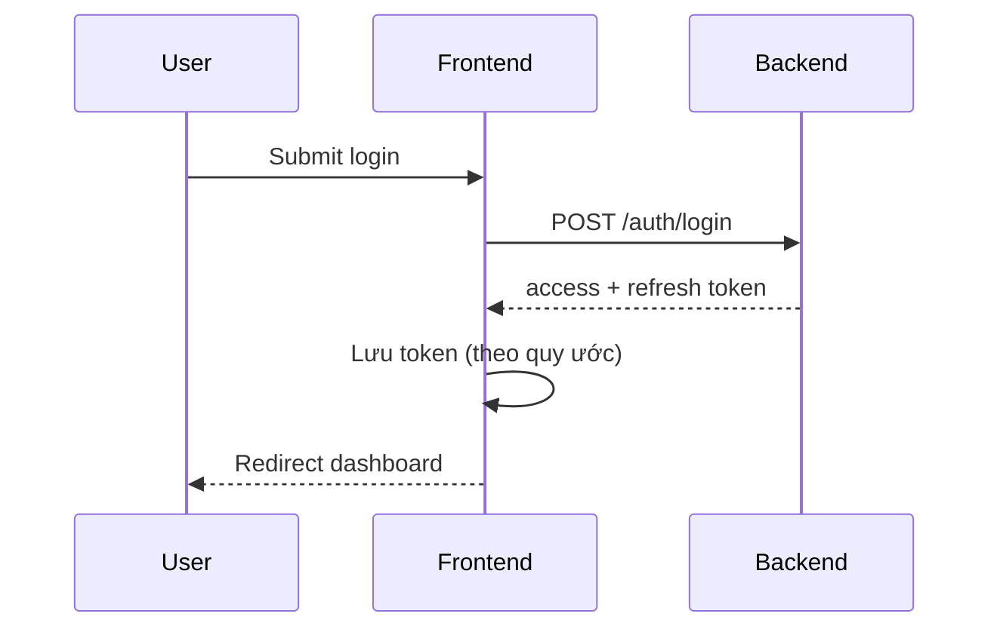

# Thiết kế kiến trúc Frontend — {Tên dự án}

**Cập nhật:** YYYY-MM-DD  
**Người phụ trách:** {Tech Lead FE}

> Copy thành `frontend-architecture.md` (cùng thư mục, bỏ prefix `_`). Tham chiếu [system-overview](../system-overview/system-overview.md).

---

## 1. Công nghệ & Thư viện cốt lõi (Tech Stack)

| Hạng mục | Công nghệ | Phiên bản | Ghi chú |
|----------|-----------|-----------|---------|
| **Framework / Library** | {React / Vue / Next.js / …} | | |
| **Ngôn ngữ** | {TypeScript / …} | | |
| **Quản lý trạng thái** | {Redux Toolkit / Zustand / Context API / …} | | Data giữa các màn hình |
| **UI / Styling** | {Tailwind CSS / MUI / Ant Design / …} | | Kết hợp Design Token (bổ sung sau) |
| **Routing** | {React Router / Next App Router / …} | | |
| **Giao tiếp dữ liệu** | {Axios / Fetch / TanStack Query / …} | | Gọi Backend, Salesforce |
| **Form** | {react-hook-form / Formik / …} | | |
| **Build tool** | {Vite / Webpack / …} | | |

**Design Token:** _(tài liệu riêng — bổ sung sau trong `architecture-fe/`)_

---

## 2. Cấu trúc thư mục dự án (Project Directory Structure)

Quy ước tổ chức `frontend/` — nhiều dev làm song song, giảm conflict.

```
frontend/
├── src/
│   ├── components/     # UI dùng chung (Button, Input, Modal…)
│   ├── pages/          # hoặc app/ — màn hình chính
│   ├── hooks/          # Custom hooks
│   ├── services/       # Gọi API Backend / Salesforce
│   ├── store/          # State toàn cục
│   ├── utils/          # Helper
│   ├── types/          # TypeScript types
│   ├── constants/      # Hằng số, route keys
│   └── assets/         # Ảnh, font tĩnh
├── public/
└── …
```

| Thư mục | Trách nhiệm | Quy tắc đặt tên |
|---------|-------------|-----------------|
| `components/` | Component tái sử dụng | PascalCase file; 1 component / file |
| `pages/` hoặc `app/` | Route-level view | Theo route hoặc feature |
| `hooks/` | Logic tách khỏi UI | Prefix `use` |
| `services/` | HTTP client, API module | Theo domain (`orderService.ts`) |
| `store/` | Global state slices | Theo feature module |

---

## 3. Luồng xử lý chung (Common Flows & Core Mechanisms)

### 3.1 Authentication Flow

| Bước | Mô tả |
|------|--------|
| Đăng nhập | {API endpoint, payload} |
| Lưu token | {LocalStorage / HttpOnly Cookie / …} |
| Access / Refresh | {Cơ chế refresh khi hết hạn} |
| Đăng xuất | {Xóa token, redirect} |



### 3.2 Routing & Permission

| Quy tắc | Mô tả |
|---------|--------|
| Route public | {/login, /register, …} |
| Route protected | {Yêu cầu token / role} |
| Chặn quyền | {Guard component / middleware — chưa login → /login} |
| Role-based | {Tham chiếu [matrix-design.md](../matrix-design/matrix-design.md)} |

### 3.3 Error & Exception Handling

| Tình huống | Cách xử lý |
|------------|------------|
| API 4xx/5xx | Toast / modal tập trung; log client |
| Network offline | Thông báo + retry |
| 404 / 500 page | Trang lỗi riêng |
| Validation | Hiển thị lỗi field (form) |

### 3.4 Loading & Skeleton

| Pattern | Dùng khi |
|---------|----------|
| Global loader | Full-page fetch lần đầu |
| Skeleton | List / card đang tải |
| Button loading | Submit form |
| Suspense / lazy | Code-split route |

---

## 4. Tiêu chuẩn viết Code & Hiệu năng (Coding Standards & Performance)

### 4.1 Coding Convention

| Mục | Quy ước |
|-----|---------|
| Đặt tên biến / hàm | camelCase; component PascalCase |
| ESLint / Prettier | {Link config hoặc mô tả rule chính} |
| Import order | External → internal → relative |
| Comment | Tiếng Anh; giải thích *why* khi cần |

### 4.2 Performance Optimization

| Kỹ thuật | Áp dụng |
|----------|---------|
| Lazy loading route | `React.lazy` / dynamic import |
| API caching | TanStack Query staleTime / cache |
| Memoization | `useMemo`, `useCallback` khi đo được re-render |
| Hình ảnh | WebP, lazy load, kích thước responsive |
| Bundle | Phân tích `vite-bundle-visualizer` / tương đương |

---

## Tài liệu liên quan

| Loại | Đường dẫn |
|------|-----------|
| System Overview | [system-overview.md](../system-overview/system-overview.md) |
| Architecture BE | [backend-architecture.md](../architecture-be/backend-architecture.md) |
| Matrix design | [matrix-design.md](../matrix-design/matrix-design.md) |
| NFR | [03_non-functional-requirements](../../../03_non-functional-requirements/catalog.md) |

## Phê duyệt

| | |
|---|---|
| **Người review** | |
| **Ngày** | |
| **Trạng thái** | draft / approved |
