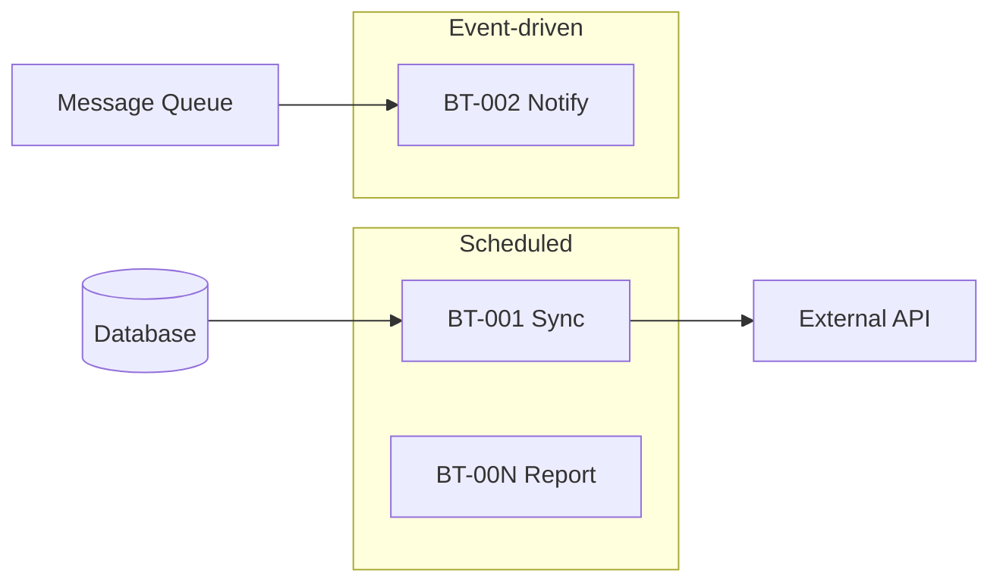

# Batch Overview (Tổng quan tác vụ chạy ngầm) — {Tên dự án}

**Cập nhật:** YYYY-MM-DD  
**Timezone mặc định (cron):** {Asia/Tokyo | UTC | …}

> Copy thành `batch-overview.md` (cùng thư mục, bỏ prefix `_`). Mỗi dòng = một batch/job. Spec chi tiết từng job: link task **Design**.

---

## 0. Quy ước

| Mục | Quy ước |
|-----|---------|
| Mã batch | `BT-001`, `BT-002`, … |
| Loại kích hoạt | `Scheduled` · `Event-driven` · `Queue` · `Manual` |
| Ghi chú ký hiệu | Retry: `3x/5m` = 3 lần, cách 5 phút |

---

## 1. Master list

| Batch ID | Tên batch | Loại | Trigger / Schedule | Input | Output | Process overview | Error handling | Owner | DD |
|----------|-----------|------|-------------------|-------|--------|------------------|----------------|-------|-----|
| BT-001 | {Sync_Entity_To_External} | Scheduled | `0 2 * * *` (02:00 hàng ngày) | `{bảng / API nguồn}` | `{Salesforce / …}` | Lấy delta → Validate → Map field → Push API → Ghi sync log | Retry 3x; alert Slack `#ops`; log correlation id | {BE team} | — |
| BT-002 | {Send_Notification_Job} | Event-driven | Event `{domain.event}` | `{queue message}` | Email / push | Consume → Filter → Template → Send | DLQ sau 5 lần; email ops | {BE team} | — |

---

## 2. Sơ đồ nhóm job *(tuỳ chọn)*

---

## 3. Chính sách lỗi & vận hành

| Mục | Quy ước dự án |
|-----|----------------|
| Retry mặc định | {ví dụ: 3 lần, exponential backoff} |
| Alert | {Slack channel / email ops} |
| Structured log | {JSON + correlation id} |
| DLQ / failed jobs | {queue / bảng `failed_jobs`} |
| Tắt job ở dev | {env `RUN_BATCHES=false` hoặc chỉ manual} |

Chi tiết lỗi HTTP khi job gọi API: [api-error-handling.md](../api-error-handling/api-error-handling.md)

---

## 4. Implementation *(điền khi có code)*

| Hạng mục | Đường dẫn / ghi chú |
|----------|---------------------|
| Scheduler | `{path/to/schedule}` |
| Queue / worker | `{queue name, worker command}` |
| Job classes | `{path/to/jobs/}` |

---

## Tài liệu liên quan

| Loại | Đường dẫn |
|------|-----------|
| Architecture BE | [backend-architecture.md](../architecture-be/backend-architecture.md) |
| System Overview | [system-overview.md](../system-overview/system-overview.md) |
| API error handling | [api-error-handling.md](../api-error-handling/api-error-handling.md) |

## Phê duyệt

| | |
|---|---|
| **Người review** | |
| **Ngày** | |
| **Trạng thái** | draft / approved |
