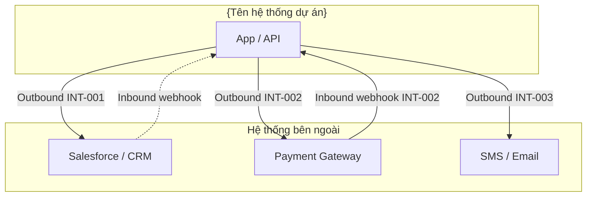

# External Interface Overview (Tổng quan giao tiếp hệ thống bên ngoài) — {Tên dự án}

**Cập nhật:** YYYY-MM-DD

> Copy thành `external-interface-overview.md` (cùng thư mục, bỏ prefix `_`). Mỗi dòng = một interface. Spec chi tiết (field, schema): **Interface Specification** — link task **Design**.

---

## 0. Quy ước

| Mục | Quy ước |
|-----|---------|
| Mã interface | `INT-001`, `INT-002`, … |
| Direction | `Outbound` · `Inbound` · `Bidirectional` |
| Kích hoạt | `Real-time` · `Batch` (ghi `BT-xxx` nếu có) |

---

## A. Sơ đồ liên kết hệ thống

---

## B. Bảng danh mục Interface

| Interface ID | Hệ thống liên kết | Mục đích | Direction | Protocol / Format | Tần suất / Kích hoạt | Bảo mật | Chức năng bị ảnh hưởng | Owner | DD |
|--------------|-------------------|----------|-----------|-------------------|----------------------|---------|-------------------------|-------|-----|
| INT-001 | {Salesforce} | Đồng bộ lead/account CRM | Outbound (+ Inbound nếu có) | REST JSON | Real-time + Batch `BT-001` | OAuth 2.0 | Module CRM, báo cáo sales | {BE team} | — |
| INT-002 | {Payment gateway} | Tạo link thanh toán, nhận kết quả | Outbound + Inbound | REST + Webhook JSON | Real-time | API Key + HMAC signature | Checkout, đơn hàng | {BE team} | — |

---

## C. Quy ước kết nối chung

| Mục | Quy ước dự án |
|-----|----------------|
| HTTP timeout (outbound) | {ví dụ: 30s} |
| Retry | {ví dụ: 3 lần, chỉ idempotent} |
| Webhook inbound | Verify signature; idempotency key |
| Secret / credential | {Vault / env — không commit} |
| Lỗi API nội bộ | [api-error-handling.md](../api-error-handling/api-error-handling.md) |

---

## D. Implementation *(điền khi có code)*

| Hạng mục | Đường dẫn / ghi chú |
|----------|---------------------|
| Integration clients | `{path/to/integrations/}` |
| Env variables | `{SF_CLIENT_ID, PAYMENT_API_KEY, …}` |
| Webhook routes | `{path hoặc prefix}` |

---

## Tài liệu liên quan

| Loại | Đường dẫn |
|------|-----------|
| System Overview | [system-overview.md](../system-overview/system-overview.md) |
| Architecture BE | [backend-architecture.md](../architecture-be/backend-architecture.md) |
| Batch overview | [batch-overview.md](../batch-overview/batch-overview.md) |
| API error handling | [api-error-handling.md](../api-error-handling/api-error-handling.md) |

## Phê duyệt

| | |
|---|---|
| **Người review** | |
| **Ngày** | |
| **Trạng thái** | draft / approved |
