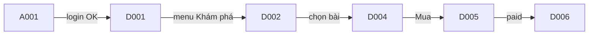

# Screen Flow (Luồng di chuyển giữa các màn hình)

Tài liệu mô tả **người dùng đi từ màn hình này sang màn hình nào trong sản phẩm** — bấm gì, điều kiện gì, màn tiếp theo là gì.

Không phải danh sách màn ([screen-list](../screen-list/_screen-list.template.md)). Không phải layout từng màn (Detail Design).

---

## Mục đích

Ghi lại **luồng chuyển màn trên UI**:

- Từ màn **A001 Login**, đăng nhập xong → vào màn nào?
- Ở **D004 Đọc bài**, bấm *Mua* → sang **D005 Checkout** hay modal?
- Menu / tab / breadcrumb → mở màn nào?
- Chưa đăng nhập mà vào **D006** → bị đẩy về **A001**?
- Nút Back / đóng popup → quay lại màn trước hay thoát luồng?

Một dòng trong doc = **một lần chuyển màn** (có thể kèm điều kiện).

---

## Viết thế nào

### Bảng chuyển màn

| Màn hiện tại | Thao tác / điều kiện | Màn tiếp theo |
|--------------|----------------------|---------------|
| A001 | Đăng nhập OK, role Reader | D001 |
| A001 | Đăng nhập OK, role Admin | E001 |
| D004 | Bấm *Mua bài* (có phí) | D005 |
| D005 | Thanh toán thành công | D006 |
| D005 | Hủy | D004 |
| * | Chưa login, vào route bảo vệ | A001 |

Dùng **Screen ID** (cùng mã với screen-list).

### Sơ đồ luồng màn hình

Vẽ theo **hành trình người dùng trên màn hình**, không vẽ cấu trúc repo hay thư mục code.

### (Tuỳ chọn) Điểm vào / ra của từng màn

| Screen ID | Vào từ | Ra đi (các nhánh chính) |
|-----------|--------|-------------------------|
| D004 | D001, D002, D003, link trực tiếp | D005, D008, quay D002 |

---

## Phân biệt nhanh

| | Nội dung |
|---|----------|
| **screen-list** | Có những màn nào (ID, path, SEO…) |
| **screen-flow** | Trên UI, từ màn này sang màn kia bằng cách nào |
| **business-flow** | Nghiệp vụ / actor (có thể 1 bước = nhiều màn) |

---

## Khi nào cần

- Đã có screen-list (biết ID các màn)
- Trước implement routing FE hoặc trước DD chi tiết từng màn
- Luồng phức tạp: đăng ký, thanh toán, duyệt admin, onboarding…

**project-base:** chỉ README này. Dự án tạo file ví dụ `screen-flow.md` trong thư mục này khi cần.

---

## Checklist

- [ ] Mọi màn trong sơ đồ có trong screen-list
- [ ] Happy path + nhánh hủy / lỗi / chưa đăng nhập
- [ ] Role khác nhau → nhánh sau login đã rõ
- [ ] Khớp với AC trong task `.backlogs/` (nếu có)

Skill: [design-workflow](../../../../.cursor/skills/design-workflow/SKILL.md)
