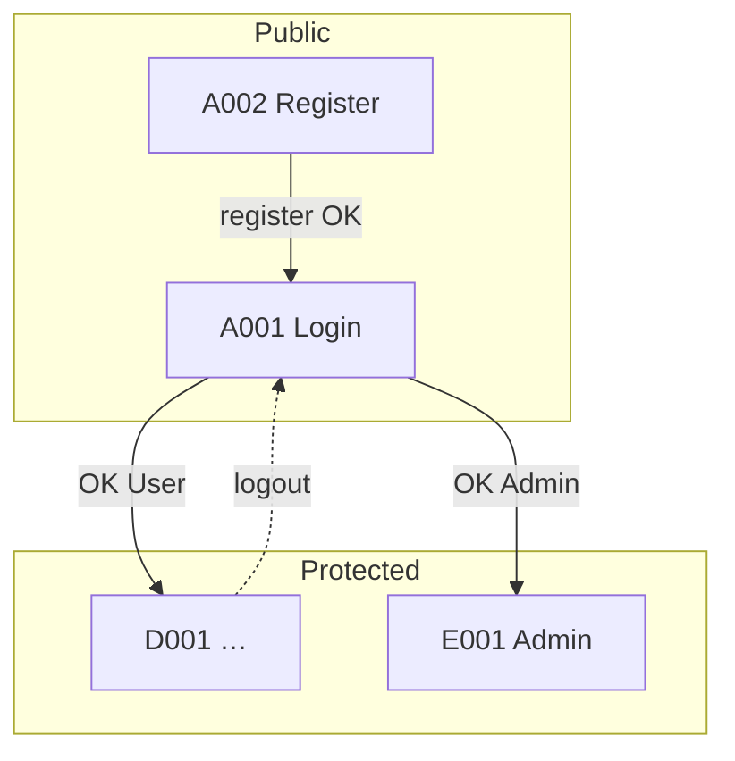

# Screen Flow (Luồng di chuyển màn hình) — {Tên dự án}

- **Dự án:** {Tên dự án}
- **Version:** v{X.Y}
- **Cập nhật:** YYYY-MM-DD
- **Phạm vi:** {Web / Admin / Mobile web — module chính}

> Copy thành `screen-flow.md` (cùng thư mục, bỏ prefix `_`). **Screen ID** phải khớp [screen-list.md](../screen-list/screen-list.md). Không mô tả layout từng màn — xem Detail Design.

---

## 0. Quy ước

| Mục | Quy ước |
|-----|---------|
| **Screen ID** | Cùng mã với `screen-list.md` (vd. `A001`, `D004`) |
| **Màn hiện tại** | ID hoặc `*` (mọi màn protected) |
| **Thao tác / điều kiện** | Nút, link, menu, guard, role, kết quả API |
| **Màn tiếp theo** | ID màn đích, `modal:{ID}`, `back`, `external:{url}` |
| **Luồng** | Đặt tên `FLOW-01`, `FLOW-02`… nếu cần trace AC |

---

## 1. Bảng chuyển màn (Transition table)

Mỗi dòng = **một lần** chuyển màn trên UI.

| Luồng | Màn hiện tại | Thao tác / điều kiện | Màn tiếp theo | Ghi chú |
|-------|--------------|----------------------|---------------|---------|
| FLOW-01 | {A001} | Đăng nhập thành công, role {User} | {D001} | Happy path |
| FLOW-01 | {A001} | Đăng nhập thành công, role {Admin} | {E001} | |
| FLOW-01 | {A001} | Sai mật khẩu | {A001} | Toast lỗi, không chuyển màn |
| FLOW-02 | {D001} | Bấm menu *{Tên}* | {D002} | |
| FLOW-02 | {D004} | Bấm *{CTA}* | {D005} | |
| FLOW-02 | {D005} | Thanh toán / submit OK | {D006} | |
| FLOW-02 | {D005} | Hủy / Back | {D004} | |
| AUTH | * | Chưa đăng nhập, vào route protected | {A001} | Redirect + `returnUrl` |
| AUTH | * | Đã login, vào `/login` | {D001} | Redirect home |
| ERR | * | Route không tồn tại | {E404} | |
| ERR | * | Không đủ quyền (403) | {E403} hoặc {D001} | Chốt với [matrix-design](../matrix-design/matrix-design.md) |

---

## 2. Sơ đồ luồng màn hình

### 2.1 Happy path — {Tên luồng, vd. Onboarding / Mua hàng}

```mermaid
flowchart LR
    A001[{A001 Login}] -->|login OK| D001[{D001 Home}]
    D001 -->|menu| D002[{D002 …}]
    D002 -->|chọn item| D004[{D004 …}]
    D004 -->|CTA| D005[{D005 …}]
    D005 -->|success| D006[{D006 …}]
```

### 2.2 Luồng phụ *(tuỳ chọn — auth, admin, hủy)*



Vẽ theo **hành trình người dùng trên màn hình** — không vẽ cấu trúc thư mục code.

---

## 3. Điểm vào / ra theo màn *(tuỳ chọn)*

| Screen ID | Vào từ (màn / deep link) | Ra đi (nhánh chính) |
|-----------|---------------------------|---------------------|
| {D004} | {D001}, {D002}, link trực tiếp `{/path}` | {D005}, {D008}, Back → {D002} |
| {D005} | {D004} | {D006} (OK), {D004} (hủy) |
| {…} | | |

---

## 4. Modal / drawer / overlay *(nếu có)*

| Màn / context | Thao tác mở | Đóng → quay về |
|---------------|-------------|----------------|
| {D004} | Bấm *{…}* | `modal:{M001}` — đóng → {D004} |
| {…} | | |

---

## 5. Mapping route FE *(điền khi có code)*

| Screen ID | Path / route name | Guard |
|-----------|-------------------|-------|
| {A001} | `/login` | public |
| {D001} | `/` | auth |
| {E001} | `/admin` | auth + role admin |

Chi tiết guard: [frontend-architecture.md](../architecture-fe/frontend-architecture.md) § Routing & Permission.

---

## Tài liệu liên quan

| Loại | Đường dẫn |
|------|-----------|
| Screen list | [screen-list.md](../screen-list/screen-list.md) |
| Matrix design | [matrix-design.md](../matrix-design/matrix-design.md) |
| Architecture FE | [frontend-architecture.md](../architecture-fe/frontend-architecture.md) |
| Function list | [catalog.md](../../../02_function-list/catalog.md) |

## Phê duyệt

| | |
|---|---|
| **Người review** | |
| **Ngày** | |
| **Trạng thái** | draft / approved |
