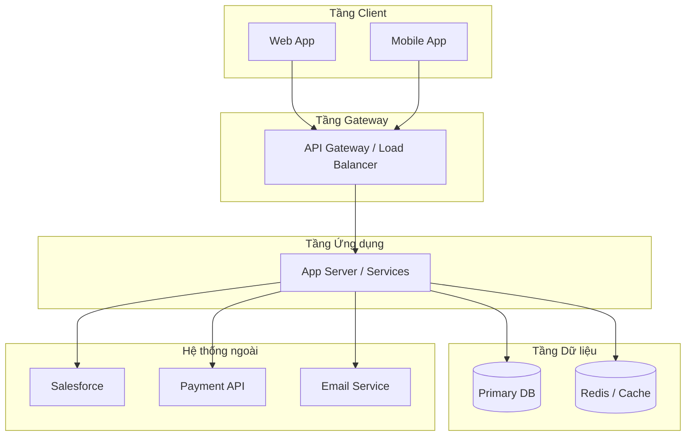
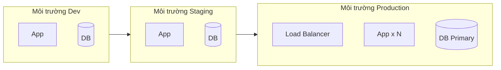
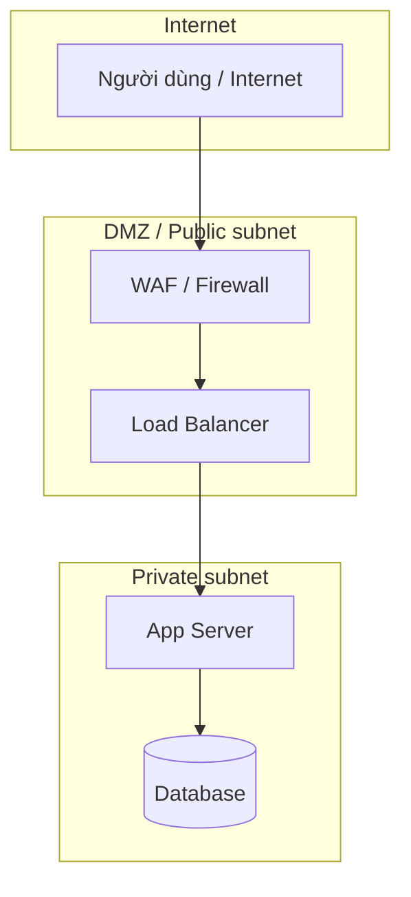
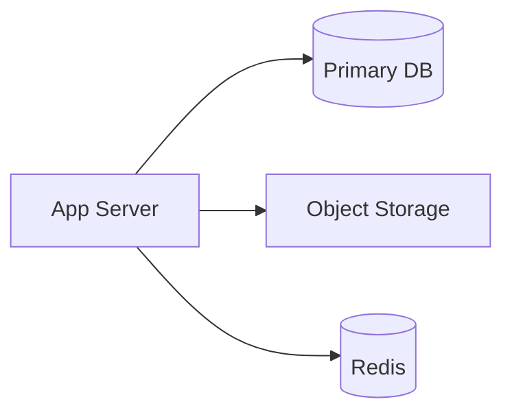
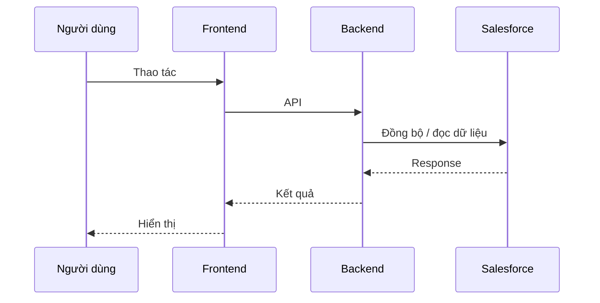

# Tổng quan hệ thống (System Overview) — {Tên dự án}

**Phase:** {1 | 2 | MVP | …}  
**Cập nhật:** YYYY-MM-DD  
**Người phụ trách:** {Tech Lead / Architect}

> Basic Design — bản **phối cảnh** trước Detail Design. Copy file này thành `system-overview.md` (cùng thư mục, bỏ prefix `_`).

---

## 1. Giới thiệu & Mục tiêu (Introduction & Objectives)

### 1.1 Mục đích tài liệu

| Mục | Nội dung |
|-----|----------|
| **Viết cho ai** | Khách hàng, PM, BrSE, Tech Lead, Developer, Infra/DevOps |
| **Dùng để làm gì** | Thống nhất cách hiểu hệ thống; làm nền cho Architecture, Integration, Business/Data Flow |
| **Không thay thế** | AC trong `.backlogs/`; spec chi tiết API/màn hình (Detail Design) |

### 1.2 Bối cảnh dự án (Background)

| Mục | Mô tả |
|-----|--------|
| **Vấn đề hiện tại** | {Pain point — ví dụ: dữ liệu rời rạc, không đồng bộ CRM} |
| **Lý do xây dựng** | {Vì sao cần hệ thống / phase này} |
| **Tham chiếu nghiệp vụ** | [01_business-requirements/overview.md](../../../01_business-requirements/overview.md) |

### 1.3 Mục tiêu hệ thống (System Goals)

| # | Mục tiêu | Giá trị / kết quả mong đợi | Đo lường (nếu có) |
|---|----------|----------------------------|-------------------|
| G-01 | {Ví dụ: Đồng bộ dữ liệu với Salesforce} | {Giảm nhập tay} | {SLA, % đồng bộ} |
| G-02 | | | |
| G-03 | | | |

### 1.4 Phạm vi hệ thống (Scope)

| Trong phạm vi (IN) | Ngoài phạm vi (OUT) |
|---------------------|---------------------|
| … | … |

---

## 2. Kiến trúc tổng thể (High-Level Architecture)

### 2.1 Sơ đồ kiến trúc (Architecture Diagram)

Mô hình phân tầng — chỉnh sửa cho đúng dự án (Client-Server, Microservices, …).

| Tầng | Thành phần | Vai trò ngắn gọn |
|------|------------|------------------|
| Client | Web / Mobile | Giao diện người dùng |
| Gateway | API Gateway, LB | Routing, TLS, rate limit |
| App | Backend services | Nghiệp vụ, API |
| Data | DB, Cache | Lưu trữ & cache |
| External | Salesforce, … | Tích hợp bên thứ ba |

**Chi tiết stack:** → [frontend-architecture.md](../architecture-fe/frontend-architecture.md) · [backend-architecture.md](../architecture-be/backend-architecture.md)

### 2.2 Mô hình triển khai (Deployment Diagram)

| Môi trường | Mục đích | Nền tảng | URL / định danh | Ghi chú |
|------------|----------|----------|-----------------|---------|
| Dev | Phát triển | {AWS / Azure / On-Premise / TBD} | | |
| Staging | UAT, tích hợp | | | |
| Production | Người dùng thật | | | |

### 2.3 Sơ đồ mạng & bảo mật (Network & Security Diagram)

| Thành phần | Mô tả | Ghi chú bảo mật |
|------------|--------|-----------------|
| VPC / VNet | {Id hoặc mô tả zone} | Tách public / private |
| Firewall / WAF | | Chỉ mở port cần thiết |
| Subnet App | | Không public IP trực tiếp |
| Subnet DB | | Chỉ App tier truy cập |

**Chi tiết:** → [NFR Security](../../../03_non-functional-requirements/catalog.md) · `infra/` (khi có)

---

## 3. Thành phần hệ thống (System Components)

### 3.1 Bảng thành phần

| Thành phần | Công nghệ | Mục đích | Phiên bản (ví dụ) |
|------------|-----------|----------|-------------------|
| FE — Web App | {React / Vue / …} | Giao diện web | |
| FE — Form | react-hook-form | Xử lý thao tác form | 5.3 |
| FE — Mobile | {Flutter / React Native / —} | App di động | |
| BE — API | {Node.js / Java / Python / …} | REST/GraphQL | |
| BE — Auth | {JWT / OAuth / …} | Xác thực | |
| Gateway | {Kong / ALB / …} | Routing | |
| DB | {PostgreSQL / MySQL / …} | Dữ liệu chính | |
| Cache | {Redis / —} | Session, cache | |
| Queue | {SQS / RabbitMQ / —} | Async (nếu có) | |

### 3.2 Ứng dụng phía người dùng (Frontend)

| Kênh | Stack | Ghi chú |
|------|-------|---------|
| Web | | SPA / SSR |
| Mobile | | iOS / Android / cross-platform |

→ Chi tiết: [frontend-architecture.md](../architecture-fe/frontend-architecture.md)

### 3.3 Hệ thống xử lý trung tâm (Backend)

| Service / module | Trách nhiệm | Giao tiếp |
|------------------|-------------|-----------|
| {api-gateway} | | |
| {order-service} | | REST / gRPC |
| {sync-service} | Đồng bộ Salesforce | |

→ Chi tiết: [backend-architecture.md](../architecture-be/backend-architecture.md)

### 3.4 Tích hợp bên thứ ba (Third-party Integrations)

| Hệ thống | Hướng | Giao thức | Mục đích |
|----------|-------|-----------|----------|
| Salesforce | in / out / hai chiều | REST / Bulk API | CRM, đồng bộ lead/account |
| Payment | out | REST | Thanh toán |
| Email | out | SMTP / API | Gửi mail |
| Maps / Định vị | out | API | (nếu có) |

→ Chi tiết: [external-interface-overview.md](../external-interface-overview/external-interface-overview.md) · DD (Interface Specification): link task **Design**

---

## 4. Quản lý dữ liệu & Lưu trữ (Data & Storage Overview)

| Loại | Công nghệ | Mục đích | Ghi chú |
|------|-----------|----------|---------|
| **Cơ sở dữ liệu chính** | {PostgreSQL / MySQL / MongoDB / …} | RDBMS / NoSQL — dữ liệu nghiệp vụ | |
| **Cache** | {Redis / —} | Session, rate limit | |
| **Object Storage** | {AWS S3 / Azure Blob / …} | Hình ảnh, tài liệu, export | |
| **Search** | {Elasticsearch / —} | Full-text (nếu có) | |

**Chi tiết bảng/entity:** → DD (link task **Design**)

---

## 5. Luồng xử lý chính (Core Workflows)

Tóm tắt mức tổng quan — chi tiết luồng nghiệp vụ / data flow do dự án bổ sung (link task **Design**).

| # | Luồng | Mô tả ngắn | Tài liệu chi tiết |
|---|-------|------------|-------------------|
| W-01 | {Luồng 1} | {Mô tả} | — |
| W-02 | {Luồng 2} | | — |
| W-03 | | | |

### 5.1 Sơ đồ luồng (sequence tổng quan)

---

## Tài liệu liên quan (Related docs)

| Loại | Đường dẫn |
|------|-----------|
| Yêu cầu nghiệp vụ | [01_business-requirements/overview.md](../../../01_business-requirements/overview.md) |
| Danh mục chức năng | [02_function-list/catalog.md](../../../02_function-list/catalog.md) |
| NFR | [03_non-functional-requirements/catalog.md](../../../03_non-functional-requirements/catalog.md) |
| Architecture FE/BE | [architecture-fe/](../architecture-fe/) · [architecture-be/](../architecture-be/) |
| Screen list / flow | [screen-list/](../screen-list/) · [screen-flow/](../screen-flow/) |
| Batch overview | [batch-overview/](../batch-overview/) |
| External interface overview | [external-interface-overview/](../external-interface-overview/) |
| Backlog task | [.backlogs/{id}/ready/](../../../.backlogs/{id}/ready/{id}.md) |

---

## Phê duyệt

| | |
|---|---|
| **Người review** | |
| **Ngày** | |
| **Trạng thái** | draft / approved |
