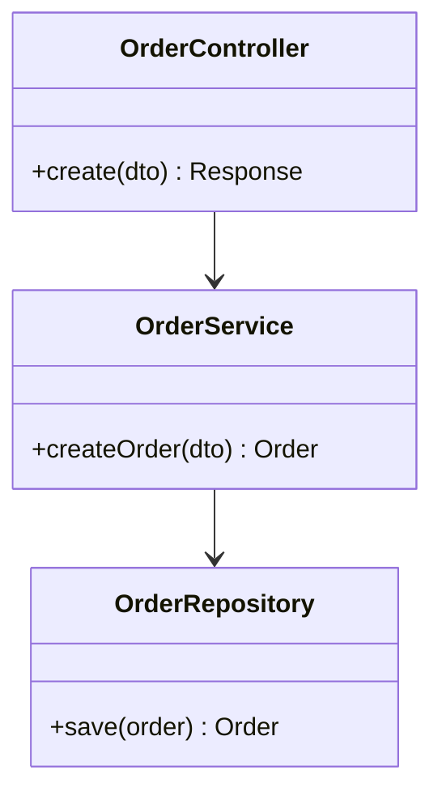

# Class Design — `{module}` — {Tên dự án}

**Cập nhật:** YYYY-MM-DD  
**Layer:** {BE service | FE feature module | …}  
**Task:** `.backlogs/{id}/ready/`

> Copy thành `{module}-class.md`.

---

## 1. Sơ đồ

---

## 2. Class / Module overview

| Class / Module | Layer | Trách nhiệm | Phụ thuộc | Ghi chú |
|----------------|-------|-------------|-----------|---------|
| `{Name}Controller` | API | HTTP entry | `{Name}Service` | |
| `{Name}Service` | Domain | Nghiệp vụ | `{Name}Repository` | |

---

## 3. Methods (public)

| Class | Method | Input | Output | Mô tả | Gọi từ |
|-------|--------|-------|--------|-------|--------|
| `{Name}Service` | `create(dto)` | `CreateDto` | `Entity` | | Controller |

---

## Tài liệu liên quan

| Loại | Path |
|------|------|
| Logic design | `../logic-design/{feature}-logic.md` |
| Architecture BE | `../../basic-design/architecture-be/backend-architecture.md` |
