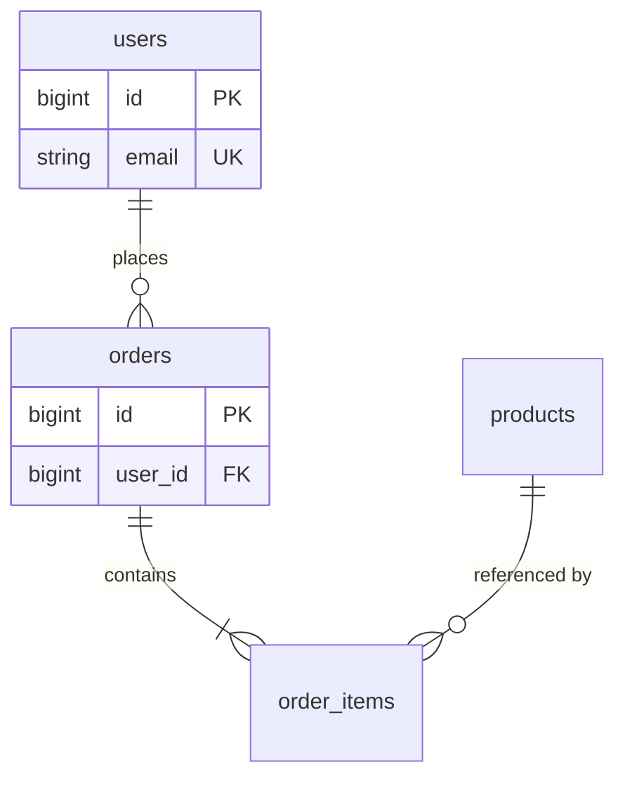

# ERD — {Module / Toàn hệ thống} — {Tên dự án}

**Cập nhật:** YYYY-MM-DD  
**Phạm vi:** {module hoặc all}

> Copy thành `erd.md` hoặc `{module}-erd.md`. Chi tiết cột → [table definition](../database-table-definition/_table-definition.template.md).

---

## 1. Sơ đồ ERD

---

## 2. Danh sách entity

| Entity | Mô tả nghiệp vụ | Ghi chú |
|--------|-----------------|---------|
| `users` | {…} | |
| `orders` | {…} | |

---

## 3. Quan hệ

| From | To | Loại | FK / junction | Ghi chú |
|------|-----|------|---------------|---------|
| `users` | `orders` | 1-N | `orders.user_id` | |

---

## Tài liệu liên quan

| Loại | Path |
|------|------|
| Table definition | `../database-table-definition/{table}.md` |
| Data dictionary | `../database-data-dictionary/data-dictionary.md` |
| Task backlog | `.backlogs/{id}/ready/` |
