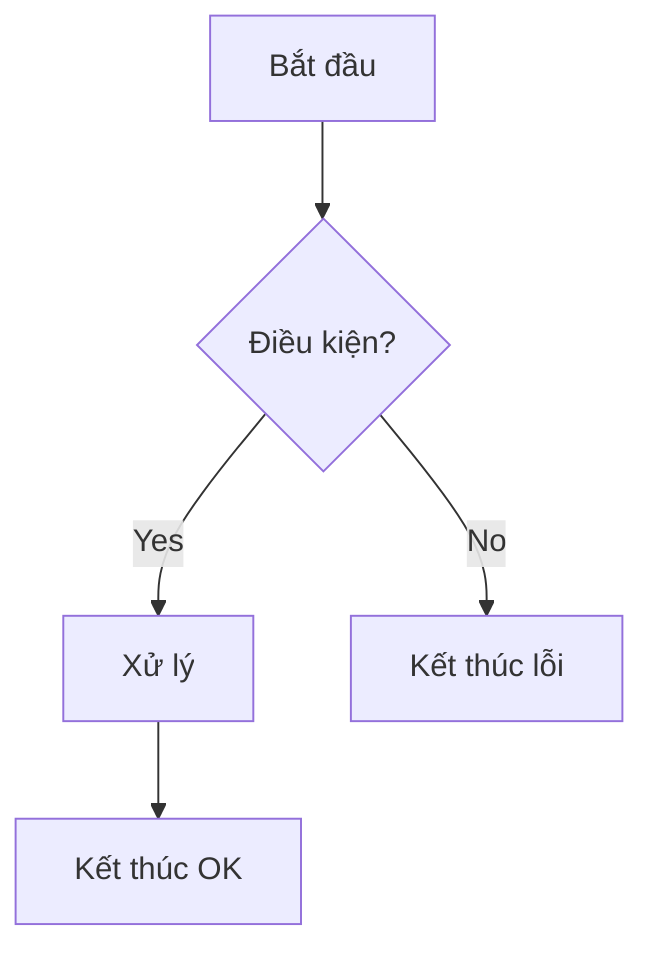

# Logic Design — `{feature}` — {Tên luồng / chức năng}

**Cập nhật:** YYYY-MM-DD  
**Task:** `.backlogs/{id}/ready/`  
**AC:** {AC-01, AC-02}  
**Screen:** `{ScreenID}` *(nếu có)*

> Copy thành `{feature}-logic.md`.

---

## 1. Tóm tắt

{Mô tả 2–3 câu luồng nghiệp vụ}

---

## 2. Luồng xử lý

| Step | Điều kiện | Hành động | Kết quả | Ghi chú |
|------|-----------|-----------|---------|---------|
| 1 | | | | |
| 2 | | | | |

---

## 3. Quy tắc nghiệp vụ

| Rule ID | Điều kiện | Kết quả | Message / error.code |
|---------|-----------|---------|----------------------|
| `R-01` | | | |
| `R-02` | | | `validation_error` / `MSG-…` |

---

## 4. State machine *(khi có)*

| Current | Event | Next | Action |
|---------|-------|------|--------|
| `pending` | `pay_success` | `paid` | Gửi email |

---

## Tài liệu liên quan

| Loại | Path |
|------|------|
| Sequence | `../sequence-diagram/{flow-id}-sequence.md` |
| API | `../api-document/{resource}-api.md` |
| Fields | `../fields-validation-messages/{ScreenID}-fields.md` |
