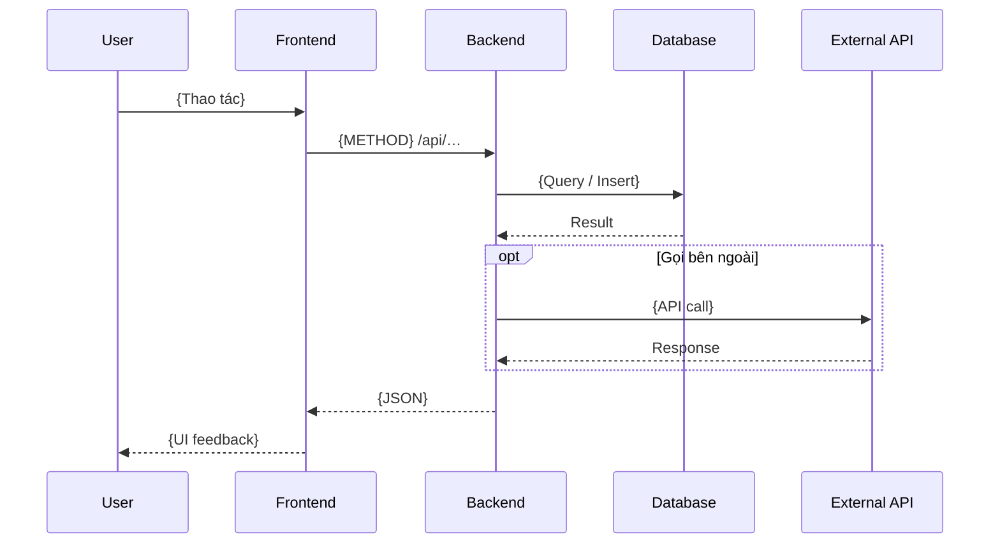

# Sequence — `{flow-id}` — {Tên luồng}

**Cập nhật:** YYYY-MM-DD  
**Trigger:** {User submit form | Cron BT-001 | Webhook INT-002}  
**Task:** `.backlogs/{id}/ready/`  
**AC:** {AC-…}

> Copy thành `{flow-id}-sequence.md`.

---

## 1. Sơ đồ

---

## 2. Bảng bước

| Step | From | To | Hành động | API / SQL / event | Ghi chú |
|------|------|-----|-----------|-------------------|---------|
| 1 | User | FE | | | |
| 2 | FE | BE | Gọi API | `POST /api/…` | [api-document](../api-document/) |
| 3 | BE | DB | Lưu | | |

---

## 3. Nhánh lỗi

| Điều kiện | Hành vi | error.code / UX |
|-----------|---------|-----------------|
| Validation fail | 422, hiển thị inline | `validation_error` |
| External timeout | Retry / alert | |

---

## Tài liệu liên quan

| Loại | Path |
|------|------|
| Logic design | `../logic-design/{feature}-logic.md` |
| API | `../api-document/{resource}-api.md` |
